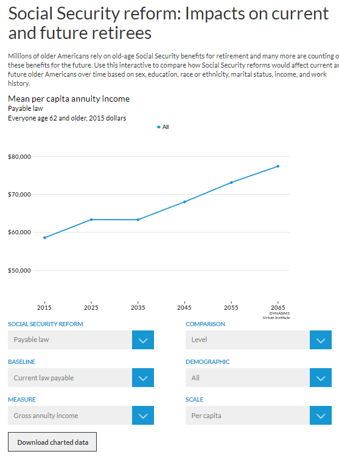

# dynasim-shiny2

Interactive web visualizations of DYNASIM projections of mean income from 2015-2065. [Link!](https://www.urban.org/policy-centers/cross-center-initiatives/program-retirement-policy/projects/dynasim-visualizing-older-americans-future-well-being/social-security-reform-impacts-current-and-future-retirees)

## Data

Data source: Urban Institute's Dynamic Simulation of Income Model (DYNASIM), 2017

## Scripts

### get-data.R

This script pulls and cleans data from the sheet "mean income" in `BPCtableShells<option>.xlsx`. The data were highly formatted in the Excel files, so the script organizes the data into a format that can be used by ggplot2. It also calculates percent and dollar change from current law scheduled and current law payable. 

### app.R

This script takes the .csv files created in `get-data.R` and stored in the data folder, and turns them into an R Shiny application.  

### themes

The R Shiny graphic is built using the [Urban Institute R theme](https://github.com/UrbanInstitute/urban_R_theme). The theme works better using Mac OSX than Windows so `urban_theme_mac.R` is used when publishing the Shiny graphic and `urban_theme_windows.R` is used for developing edits and new features. 

**Note:** Lines at the top of `app.R` need to be commented out when switching between operating systems. 

### /www

The /www subdirectory contains `shiny.css`. Shiny applications automatically look for material in the www subdirectory. The style sheet currently has a single universal css selector which changes the font in the Shiny application to [Lato](https://fonts.google.com/specimen/Lato). 

## Built With
* R
* [Shiny](https://shiny.rstudio.com/)

## Authors
* Aaron Williams
* Karen Smith
* Ben Chartoff
* Jerry Ta
* Michael Marazzi
* Dave D'Orio